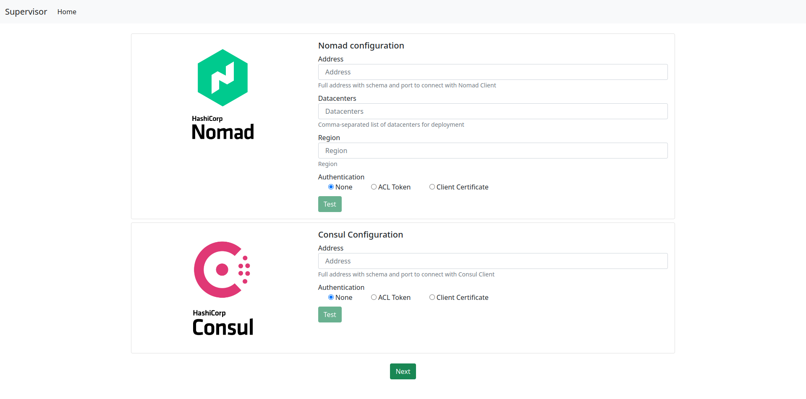

For a graphical and guided installation, TeSLA CE can be deployed using supervisor.

You need to execute the following command. If you want to deploy TeSLA in Swarm mode and supervisor in the same server, remember uncomment the line 12 in docker-compose.yml file:

```bash
docker-compose up -d
```

After that you can open your browser and go to the following URL: http://localhost:5000

Remember there is a folder called data. This folder is used to store the data of the supervisor. If you want to change the location of this folder, you need to change the path (SUPERVISOR_DATA env variable) in the docker-compose.yml file.


## Next steps

PLease follow next steps to complete the TeSLA CE installation successfully.

1. Open browser and go to http://localhost:5000

2. Select orchestrator (Nomad or Swarm) and environment (development or production)


3. Configure the orchestrator with the required information. If you select Nomad or Swarm, the information required will be different.

*Nomad*


*Swarm*


4. Insert basic configuration for TeSLA CE


5. Check DNS and deploy load balancer


6. Only in production environment. If you select development skip this step. Provide service information for TeSLA CE.


7. Only in development environment. If you select production skip this step. Deploy services.


8. Deploy supervisor service and prepare all services for TeSLA CE.


9. Configure TeSLA CE services.


10. Deploy core modules.


11. Deploy workers modules.


12. Deploy instruments.


13. Configure Moodle VLE TeSLA CE.


14. Deploy Moodle VLE TeSLA CE.


15. Backup tesla_ce.cfg and enjoy!
