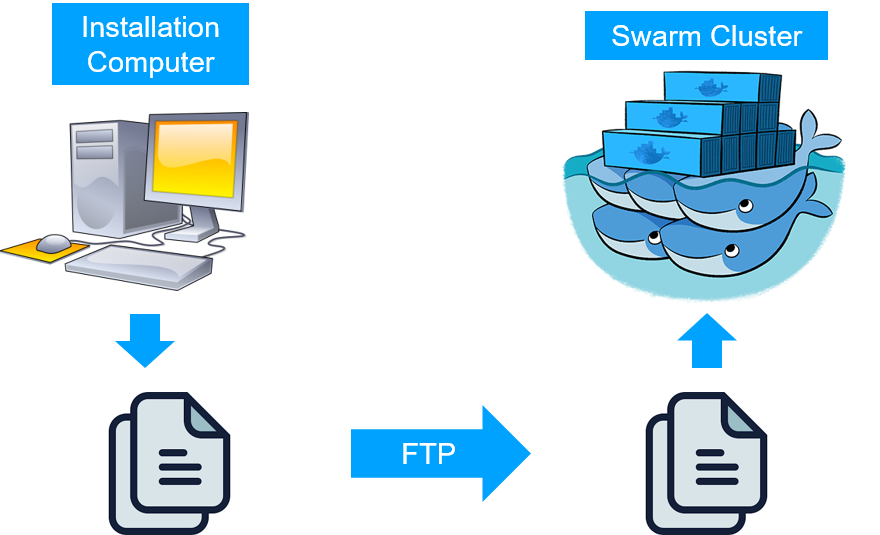

The use of Docker Swarm is the **recommended** option for self-hosted production deployments.
To maintain credentials out from the cluster, it is recommended to perform TeSLA CE installation steps from
a computer out from the cluster (**installation computer**), however, you can perform installation from one of the master nodes.

The installation process will generate a set of Docker Swarm Stack files and all required secrets to be deployed on the
cluster.

